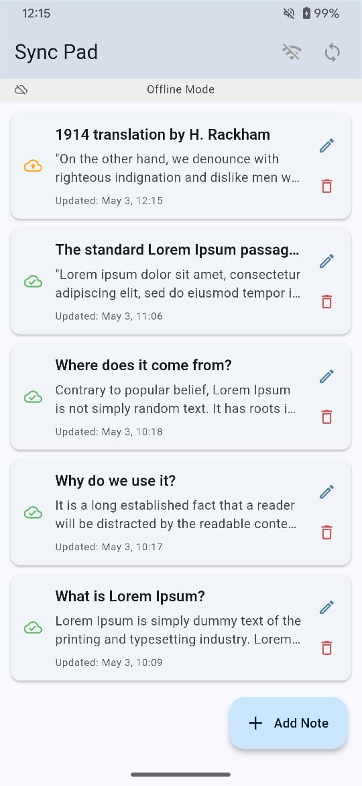
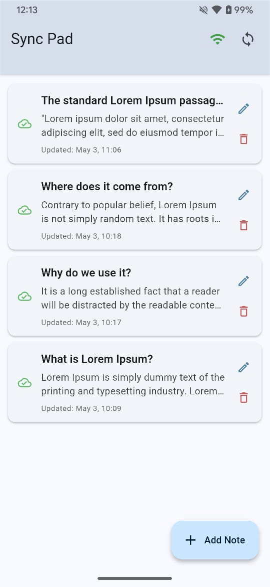

# Sync Pad - Offline-First Notes App (Flutter Demo)

## Overview

Sync Pad is a simple yet robust Flutter application demonstrating an **Offline-First Architecture** using **Hive** for local storage and **Firebase Firestore** for backend data synchronization. This project was created to fulfill Task Option 3 ("Implement Offline-First Architecture with Data Sync") for the Flutter Developer role assessment at Sqaby Technologies.

The core goal is to showcase a clean, scalable architecture where the user can create, read, update, and delete notes seamlessly, whether online or offline. Changes made offline are automatically synced to Firestore when connectivity is restored.

## 📸 Screenshots

### 🔌 Offline Mode


### 🌐 Online Mode


## 🎥 Screen Recording

[🎬 Watch Demo Video](screenshots/demo.mp4)

## Features

*   **CRUD Operations:** Create, Read, Update, and Delete notes.
*   **Offline-First:** The app primarily reads from and writes to the local Hive database, ensuring full functionality even without an internet connection. The UI always reflects the local state immediately.
*   **Local Storage:** Uses **Hive** for efficient local persistence of note data and synchronization flags.
*   **Backend Sync:** Uses **Firebase Firestore** as the backend. Changes made locally (`isSynced=false`, `isDeleted=true`) are automatically queued and synced to Firestore when the device comes online.
*   **Real-time Connectivity Detection:** Uses the `connectivity_plus` package to monitor network status in real-time.
*   **Automatic Sync on Reconnect:** Automatically attempts to sync pending changes when connectivity is restored.
*   **Manual Sync/Refresh:** Users can manually trigger a sync or refresh data from the backend via dedicated UI controls (Sync button, Pull-to-Refresh).
*   **Status Indicators:** Provides clear visual feedback for connectivity status (Online/Offline), synchronization progress (Syncing/Refreshing), and individual note sync status.
*   **Clean Architecture:** Follows Clean Architecture principles (Presentation, Domain, Data layers) for maintainability and testability.
*   **State Management:** Uses **Bloc** for predictable and robust state management.
*   **Dependency Injection:** Uses **GetIt** for managing dependencies.

## Architecture Overview

The application adheres to Clean Architecture principles, separating concerns into distinct layers:

1.  **Presentation Layer:**
    *   Contains Widgets (Screens like `NotesListScreen`, `AddEditNoteScreen`) and Blocs (`NotesBloc`).
    *   Responsible for displaying the UI and handling user interactions.
    *   Interacts with the Domain layer via Use Cases.
    *   Observes state changes from the Bloc to update the UI.

2.  **Domain Layer:**
    *   The core of the application, containing business logic and rules.
    *   Includes Entities (`NoteEntity`), abstract Repository interfaces (`NoteRepository`), and Use Cases (`GetNotes`, `SaveNote`, `DeleteNote`, `SyncNotes`, `RefreshNotes`).
    *   Independent of UI and Data layers.

3.  **Data Layer:**
    *   Implements the `NoteRepository` interface (`NoteRepositoryImpl`).
    *   Contains Data Sources (`LocalNoteDataSource`, `RemoteNoteDataSource`) responsible for interacting with Hive and Firebase Firestore respectively.
    *   Includes Models (`NoteModel` extending `NoteEntity`) which handle data mapping, Hive annotations, and local sync flags (`isSynced`, `isDeleted`).
    *   Manages data fetching, caching (via Hive), synchronization logic, and error handling related to data operations.

**Data Flow Example (Saving a Note):**
UI -> `NotesBloc` (receives SaveNoteEvent) -> `SaveNoteUseCase` -> `NoteRepository` (Interface) -> `NoteRepositoryImpl` -> Maps Entity to Model -> `LocalNoteDataSource` (saves NoteModel to Hive, `isSynced=false`) -> `NotesBloc` (refreshes local data) -> UI updates.
*(Sync happens later via `SyncNotesUseCase`)*

## Technology Stack

*   **Framework:** Flutter SDK
*   **State Management:** `flutter_bloc` / `bloc`
*   **Local Database:** `hive`, `hive_flutter`
*   **Backend Database:** Firebase Firestore (`cloud_firestore`, `firebase_core`)
*   **Dependency Injection:** `get_it`
*   **Connectivity:** `connectivity_plus`
*   **Value Equality:** `equatable`
*   **Functional Programming (Either):** `dartz`
*   **Utilities:** `intl` (Date Formatting), `uuid` (Unique IDs)
*   **Code Generation:** `build_runner`, `hive_generator`
*   **Linting:** `flutter_lints`

## Setup Instructions

### Prerequisites

*   Flutter SDK (Latest stable version recommended)
*   An IDE (VS Code, Android Studio)
*   Firebase Account ([firebase.google.com](https://firebase.google.com/))
*   Firebase CLI installed and authenticated (`firebase login`)
*   FlutterFire CLI activated (`dart pub global activate flutterfire_cli`)

### 1. Clone the Repository

```bash
git clone https://github.com/mukullogixhunt/sync_pad.git
cd sync_pad # Or your project directory name
```

### 2. Firebase Project Setup

*   Go to the [Firebase Console](https://console.firebase.google.com/).
*   Create a **new Firebase project** (or use an existing one).
*   In the project settings, **add an Android app** and an **iOS app**. Follow the on-screen instructions to download the configuration files (`google-services.json` for Android, `GoogleService-Info.plist` for iOS), but the next step (`flutterfire configure`) will handle this automatically.
*   Navigate to `Build` -> `Firestore Database`.
*   Click `Create database`.
*   Select **Start in test mode** (this allows reads/writes without authentication rules during development - **important for testing**).
    *   *Note: For production, you would configure proper security rules.*
*   Choose a Firestore location (e.g., `us-central`).
*   Click `Enable`.

### 3. Configure FlutterFire

*   Open your terminal in the root directory of this Flutter project.
*   Run `flutterfire configure`.
*   Select the Firebase project you created in the previous step using the arrow keys and Enter.
*   Follow the prompts to register your Flutter app with the selected Firebase project (choose Android and iOS platforms).
*   This command will automatically fetch configuration details and generate the `lib/firebase_options.dart` file in your project.

### 4. Install Dependencies

*   Run the following command in your project's root directory:
    ```bash
    flutter pub get
    ```

### 5. Run Code Generation

*   Hive requires generated adapter code. Run the build runner:
    ```bash
    flutter pub run build_runner build --delete-conflicting-outputs
    ```

## Running the App

1.  Ensure you have a connected emulator or physical device running.
2.  Run the app from your IDE or using the terminal:
    ```bash
    flutter run
    ```

## Folder Structure (Simplified)

```
lib/
├── core/                 # Core utilities (database, error handling, network, usecase base)
│   ├── database/         # Hive setup
│   ├── error/            # Failures, Exceptions
│   ├── network/          # ConnectivityService
│   └── usecase/          # Base UseCase class
├── features/             # Feature modules (only 'notes' here)
│   └── notes/
│       ├── data/         # Data layer implementation
│       │   ├── datasources/  # Local (Hive) & Remote (Firestore) interactions
│       │   ├── models/     # Data models (NoteModel) with mapping & annotations
│       │   └── repositories/ # Repository implementation (NoteRepositoryImpl)
│       ├── domain/       # Core business logic (independent layer)
│       │   ├── entities/   # Business entities (NoteEntity)
│       │   ├── repositories/ # Abstract repository interface (NoteRepository)
│       │   └── usecases/   # Application-specific actions (GetNotes, SaveNote, etc.)
│       └── presentation/ # UI layer
│           ├── bloc/       # Bloc, Events, State (NotesBloc)
│           ├── screens/    # UI Screens (NotesListScreen, AddEditNoteScreen)
│           └── widgets/    # Reusable UI widgets (e.g., _ActionButton - if used)
├── injection_container.dart # GetIt dependency registration setup
├── main.dart             # App entry point, initialization
└── firebase_options.dart # Generated by FlutterFire
```

## Key Concepts Demonstrated

*   **Offline-First:** App functions entirely offline using local data as the primary source.
*   **Local Caching:** Hive database stores all notes locally, enabling offline access.
*   **Connectivity Detection:** Real-time network status checking using `connectivity_plus`.
*   **Data Synchronization:** Logic implemented in `NoteRepositoryImpl` to sync local changes (new, updated, deleted notes marked with flags) to Firebase Firestore when online. Includes automatic sync on reconnect and manual triggers.
*   **Clean Architecture:** Separation of concerns into Presentation, Domain, and Data layers.
*   **State Management:** Bloc pattern manages UI state effectively.
*   **Dependency Injection:** GetIt used for decoupling components.
*   **Error Handling:** Using `Either` from `dartz` and custom `Failure`/`Exception` classes for robust error management across layers.

## Future Improvements (Optional)

*   **Advanced Conflict Resolution:** Implement strategies beyond simple "last write wins" (e.g., using vector clocks, manual merging UI).
*   **Background Sync:** Use `workmanager` or `flutter_background_service` to perform sync even when the app is not in the foreground.
*   **User Authentication:** Integrate Firebase Authentication to support multiple users.
*   **UI/UX Polish:** Add animations, improve loading states, refine visual design.
*   **Testing:** Add comprehensive Unit, Widget, and Integration tests.
*   **Throttling/Debouncing:** Prevent excessive sync attempts if connectivity flaps rapidly.
*   **Selective Sync/Fetch:** Implement fetching only changed data instead of the entire list on refresh.